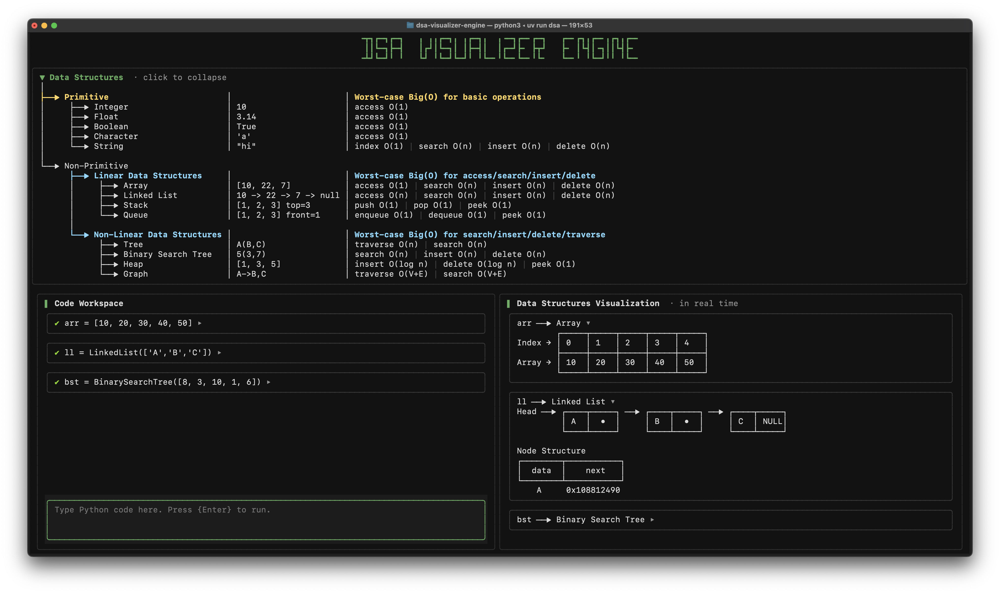

# DSA Visualizer Engine

A terminal-based interactive Python notebook that visualizes data structures as live ASCII diagrams. It's an educational tool designed to teach how variables bind to objects, mutations change memory state, and data structures behave internally.



---

## Why This Exists

Most DSA resources show *what* to type, but never explain *why* it matters.

They skip the part that actually builds understanding: **seeing how data looks in memory**.

This tool makes the invisible visible:

- **Watch variables bind** to objects
- **See mutations happen** in real time
- **Understand aliasing** through visual grouping
- **Explore data structures** interactively

Code comes **after understanding**, not before.

---

## Quick Start

### Requirements

- Python >= 3.10
- [uv](https://github.com/astral-sh/uv) (recommended)

### Install & Run

```bash
git clone https://github.com/yourusername/dsa-visualizer-engine.git
cd dsa-visualizer-engine
uv run dsa
```

Or run the module directly:

```bash
uv run python -m dsa_visualizer.main
```

---

## Usage Examples

Type Python code and press Enter. The memory panel updates after every execution.

### Arrays
```python
>>> arr = [10, 20, 30, 40, 50]
```
```
arr ──▶ Array
        ┌────┬────┬────┬────┬────┐
Index → │ 0  │ 1  │ 2  │ 3  │ 4  │
        ├────┼────┼────┼────┼────┤
Array → │ 10 │ 20 │ 30 │ 40 │ 50 │
        └────┴────┴────┴────┴────┘
```

### Linked Lists
```python
>>> ll = LinkedList([1, 2, 3])
```
```
ll ──▶ Linked List
Head ──▶ ┌────┬─────┐ ──▶ ┌────┬─────┐ ──▶ ┌────┬─────┐
         │ 1  │  •  │     │ 2  │  •  │     │ 3  │ NULL│
         └────┴─────┘     └────┴─────┘     └────┴─────┘
```

### Aliasing Visualization
```python
>>> a = [1, 2, 3]
>>> b = a  # b points to same object
```
```
a ──┐
    ├──▶ Array
b ──┘
        ┌────┬────┬────┐
Index → │ 0  │ 1  │ 2  │
        ├────┼────┼────┤
Array → │ 1  │ 2  │ 3  │
        └────┴────┴────┘
```

### Binary Search Tree
```python
>>> bst = BinarySearchTree([8, 3, 10, 1, 6])
```
```
bst ──▶ Binary Search Tree
            [8]
             ▼
      ┌─────────────┐
      ▼             ▼
     [3]           [10]
      ▼
   ┌───────┐
   ▼       ▼
  [1]     [6]
```

### Stack & Queue
```python
>>> s = Stack([1, 2, 3, 4])
>>> q = Queue(['A', 'B', 'C'])
```
```
s ──▶ Stack          q ──▶ Queue
Top                  Front ──▶ ┌─────┬─────┬─────┐ ──▶ Rear
 │                             │  A  │  B  │  C  │
 ▼                             └─────┴─────┴─────┘
┌─────┐
│  4  │
├─────┤
│  3  │
├─────┤
│  2  │
├─────┤
│  1  │
└─────┘
```

---

## Built-in Data Structures

These classes are available by default:

| Structure | Constructor Example |
|-----------|---------------------|
| `LinkedList` | `LinkedList([1, 2, 3])` |
| `DoublyLinkedList` | `DoublyLinkedList([1, 2, 3])` |
| `Stack` | `Stack([1, 2, 3])` |
| `Queue` | `Queue([1, 2, 3])` |
| `BinaryTree` | `BinaryTree([1, 2, 3])` |
| `BinarySearchTree` | `BinarySearchTree([5, 3, 7])` |
| `MinHeap` | `MinHeap([5, 3, 8, 1])` |
| `Graph` | `Graph(directed=True)` |

### Custom Structures

The engine also detects custom implementations through duck typing:

- **Linked list**: has `head` with nodes containing `value`/`data` and `next`
- **Queue**: has `enqueue()`, `dequeue()`, `peek()` methods
- **Stack**: has `push()`, `pop()`, `peek()` methods
- **Heap**: has `insert()`, `pop_min()`, `peek()` methods
- **Tree**: has `root` with nodes containing `left`, `right`, `value`/`data`
- **Graph**: has `adjacency()` method or `adjacency`/`adj` attribute

---

## Supported Visualizations

| Type | Visualization |
|------|---------------|
| **Primitives** | int, float, bool, string, None with binary representation |
| **Array** | Indexed table showing contiguous memory |
| **Hash Table** | Separate chaining bucket view |
| **Linked List** | Node chain with pointer arrows |
| **Doubly Linked List** | Bidirectional node chain |
| **Stack** | Vertical LIFO representation |
| **Queue** | Horizontal FIFO representation |
| **Binary Tree** | Hierarchical node layout |
| **Binary Search Tree** | BST with left < node < right property |
| **Min Heap** | Tree view + array representation |
| **Graph** | Adjacency list format |

---

## Controls

| Key | Action |
|-----|--------|
| `Enter` | Execute when block is complete, or insert newline |
| `?` | Toggle help panel |
| `Ctrl+Q` | Quit |

Click on a cell in the notebook to expand/collapse its memory snapshot.

---

## Who This Is For

- **Beginners** who want to see how data structures work internally
- **Self-taught developers** filling CS fundamentals gaps
- **Students** tired of abstract diagrams without concrete examples
- **Educators** wanting interactive teaching tools to teach
- **Anyone** who learns better through visualization

---

## Development

### Setup

```bash
git clone https://github.com/yourusername/dsa-visualizer-engine.git
cd dsa-visualizer-engine
uv sync --dev
```

### Commands

| Command | Description |
|---------|-------------|
| `uv run dsa` | Run the application |
| `uv run ruff check .` | Run linter |
| `uv run ruff check . --fix` | Auto-fix linting issues |
| `uv run pytest -q` | Run tests |
| `uv run pytest -v` | Run tests with verbose output |

### Project Structure

```
dsa_visualizer/
├── core/           # Execution engine, snapshotter, data structures
├── render/         # ASCII visualization renderers
└── ui/             # Textual TUI components
tests/              # Test suite with golden tests
```

---

## Important Note

This tool executes Python code directly on your machine. Only run code you understand and trust. If you accidentally run an infinite loop, use `Ctrl+C` or close the terminal to restart.

---

## License

MIT License - see [LICENSE](LICENSE) for details.

---

Made with curiosity. Built for learning.
